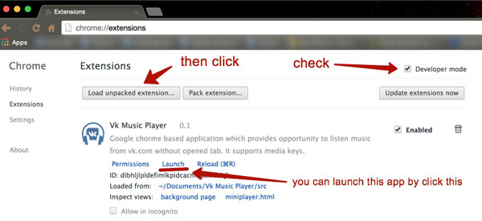

# Vk Music Player
Google Chorme based application which provides opportunity to listen music from [vk.com](https://vk.com/) without opened tab.

**It supports media keys.**

# How to install
For now this application in development, so you can install it in an ugly way.

0. Firstly you need to clone this repository or download it.
0. Copy file `src/config-example.json` to `src/config.json` and put your app_id of vkontakte application inside this file.
0. After this you should type [chrome://extensions/](chrome://extensions/) within your address bar.
0. Next, you need to install extension: 

It is all.

Now you can launch this application in any convenient way.
